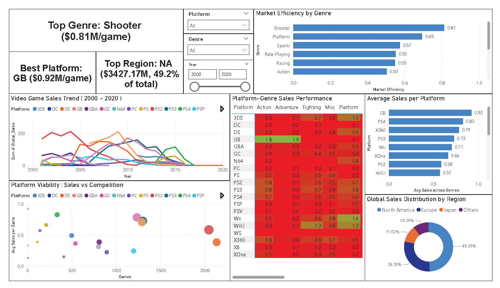

The dataset that I took is from kaggle https://www.kaggle.com/datasets/gregorut/videogamesales which is the basic premise of the project that I have made.

# Context of Project

MindGames which is a mid-sized game studio would like to create a game and profit over it and require some datas to be analysed to
maximize their revenue potential and see what is the trend of the current market for video games.

They have allocated $15M budget to use and would like to properly utilize the money that they have invested with as many information
as the data analysts that they hire could give.

The stakeholders are giving the data analysts these core questions such as :
1. Genre Selection : Which genre has the highest market efficiency?
2. Platform Priotization : What Platform is the best way to get as many customers possible?
3. Regional Localization : How should we tailor our marketing strategy to each region?

# Key Findings
1. Genre Efficiency :
   - Shooter genre has the highest revenue per game with (0.81M/game) followed by Platform genre with (0.69M/game).
   - Strategy and Adventure genre has one of the lowest market efficiency which indicates that it is severely oversaturated.
2. Platform Performance :
   - PS4 dominates the Shooter Genre with an average of (2.2M average sales), while the second platform that has a high average
     sales is Xbox One.
   - From across the platform, the Gameboy has the highest average sales for all Genre for its time.
3. Regional Demand (Shooters)
    - North America (54.1%) is the primary market, followed by:

        Europe (32.3%)

        Other Regions (11.04%)

        Japan (2.54%).

    - Allocate 55% of marketing budget to NA, 30% to EU, and minimal resources to JP.

# Recommendations

1. Risk on Shooters for PS4
   -  It has the higest revenue per Game in NA
   -  Have to monitor rising competition from other companies in the Shooter Genre
2. Pay attention to Platform Games on other platforms
   - Lower market efficiency than Shooter but there is potential to generate revenue from it
3. Regional Targeting
   - Mainly focus marketing to NA and EU market more than JP
   - Provide more resources to other regions but less towards JP
